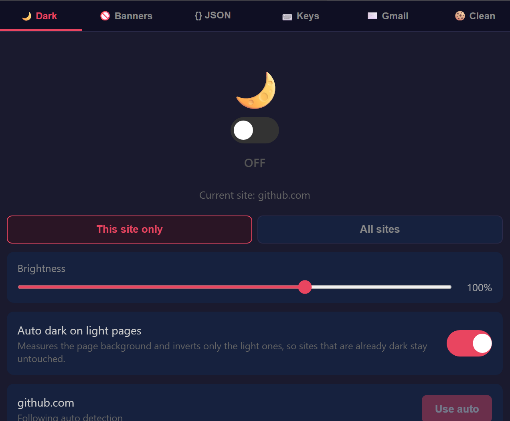

# urza's extensions

One open-source Chrome extension that bundles the browser tweaks I actually use: dark mode, cookie banner dismissal, a Gmail colour fix, keyboard navigation, a JSON formatter, Google Search fixes, and a cookie cleaner.

Forked from [superlevels](https://github.com/levelsio/superlevels) by [@levelsio](https://x.com/levelsio) — since then it's grown several features of its own and most of the original code has been reworked.

Every feature gets its own tab and its own switch, so you can run only the parts you want.

Original superlevels demo clip (predates the newer features)

## Why

Most Chrome extensions are closed-source, and a browser extension with page access is about the most dangerous software you can install. This one is small enough to read in a sitting: seven content scripts and a background worker, no build step, no dependencies, no bundled minified blobs.

Before installing **any** extension — this one included — point an AI coding tool ([Claude Code](https://claude.ai/claude-code), [Cursor](https://cursor.sh), [Codex](https://openai.com/index/openai-codex/)) at the source and ask it to *"analyze this Chrome extension for security vulnerabilities, malware, spyware, data exfiltration, and suspicious behavior."* Then read the report. Most extensions can't be audited this way. This one can.

## Features

### 🌙 Dark Mode
Instant dark mode for any site via CSS filter inversion, with adjustable brightness. Images and videos are re-inverted so they still look normal.

**Auto dark on light pages** samples the page's real background colour at several points (not just `<body>`) and inverts only the pages that come out light, leaving sites that already ship a dark theme alone. Each verdict is cached per host, so the next visit applies it before first paint instead of flashing white.

Precedence: the site's own switch → auto detection → the all-sites default.

### 🚫 Cookie Banner Dismisser
Hides cookie consent banners with CSS and auto-clicks the accept button for the common consent frameworks — OneTrust, CookieBot, Didomi, Quantcast, Termly, TrustArc, the WordPress GDPR plugins, and dozens more. Also unsticks the `overflow: hidden` these banners leave on `<body>`. Toggle it off if a site breaks.

### ✉️ Gmail Yellow Importance Marker
Gmail's September 2026 update recoloured the "important" marker from yellow to blue. This puts it back, by overriding the CSS variable Gmail fills the marker from.

Gmail's class and variable names are obfuscated and change between builds, so the script verifies its own work: once the first marker renders it checks the computed colour actually came out yellow, and if not, falls back to painting the original yellow icon (inlined as a data URI) over the marker. Runs only on `mail.google.com`.

### ⌨️ Keyboard Navigation
Vimium-style keyboard control for any page.

- **Link hints** — press `f` to label every clickable element on screen, then type the label to open it in the **current tab**; `F` opens in a **new tab**; `Esc` cancels. Labels use right-hand keys only (`y u i o p h j k l n m`), and the biggest, most central links get the shortest labels.
- **Navigation** (hold Shift) — `H` back · `K` forward · `U` close tab · `O` new tab.
- **Per-site exclude list** — switch it off on specific sites from the popup, one click for the current site. Applies live across open tabs, and ships pre-seeded with the sites whose own shortcuts clash (`youtube.com`, `mail.google.com`, `github.com`).

Needs **no extra permissions**: it's a content script that simulates clicks, and tab open/close go through the background worker (which doesn't require the `tabs` permission). Hints never trigger while you're typing in a text field.

### {} JSON Formatter
Detects pure JSON responses and formats them with syntax highlighting, collapsible sections, and a dark theme — copy or view raw with one click. Matches on content type, with a fallback for APIs that serve JSON as `text/plain`. Never triggers on regular HTML pages.

### 🗺 Google Maps Links
Re-adds the Maps tab and clickable map preview cards to Google Search results.

### 🖼 View Image
Puts the "View Image" button back on Google Images, linking straight to the full-size original.

### 🍪 Cookie Cleaner
Wipes cookies on browser startup for every domain **not** on your whitelist — stay logged in where you want, clear everything else automatically.

- **Off by default**, so it never surprise-deletes anything; enable it in the popup when you're ready.
- Ships with a sensible default whitelist (Google, Microsoft/Apple, major socials, dev tools, media), fully editable.
- One click to whitelist the current site, plus a **Clean now** button to run on demand.
- Matching is subdomain-inclusive (`google.com` also keeps `mail.google.com`).

## Install

1. Clone or download this repo
2. Open `chrome://extensions/`
3. Enable **Developer mode** (top right)
4. Click **Load unpacked** and select this repo's folder
5. The icon appears in your toolbar — done

Works in any Chromium browser (Chrome, Edge, Brave, Vivaldi). To update, `git pull` and hit reload on the extension card.

## Permissions

Manifest V3, and only two permissions:

- `storage` — your settings, in `chrome.storage.local`
- `cookies` — required by the Cookie Cleaner to read and remove cookies
- `host_permissions: <all_urls>` — dark mode and banner dismissal have to work on every site you visit

## Privacy

- **No data collection.** Everything stays local in `chrome.storage.local`.
- **No analytics, no tracking, no phone-home.**
- **No external network requests.** The one image the extension ships is inlined as a data URI.
- All source is right here. Read it, audit it, fork it.

## License

MIT
