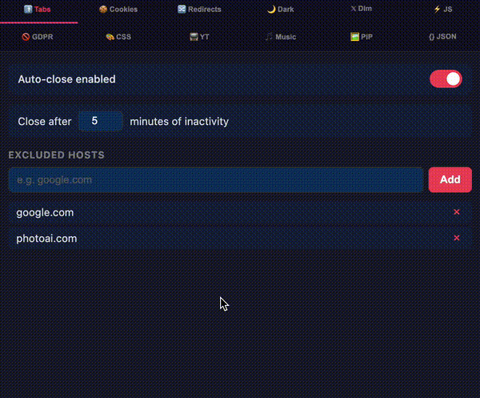

# urza's extensions

Forked from [superlevels](https://github.com/levelsio/superlevels) by [@levelsio](https://x.com/levelsio).

Please star SuperLevels if you like it!

A super Chrome extension that bundles several useful browser tools into one open-source, privacy-respecting package.

Most Chrome extensions are closed-source malware/spyware-filled garbage that form a massive security risk. This one is open source and you can read and check the source code (with AI) before you install it, and customize it to your liking!

## Demo

## Security

Before installing any Chrome extension, you should verify it's safe. This extension is fully open source so you can audit every line of code yourself — or let AI do it for you:

1. Clone this repo or point your AI tool at the source code
2. Use [Cursor](https://cursor.sh), [Claude Code](https://claude.ai/claude-code), [Codex](https://openai.com/index/openai-codex/), or any AI coding tool
3. Ask it: *"Analyze this Chrome extension for security vulnerabilities, malware, spyware, data exfiltration, and any suspicious behavior"*
4. Read the report before you install

You should do this for **every** Chrome extension you use. Most extensions are closed-source and can't be audited — this one can.

## Features

### 🌙 Dark Mode
Instant dark mode for any website using CSS filter inversion. Adjustable brightness. Toggle per-site or globally. Images and videos are automatically re-inverted so they look normal.

### 🚫 GDPR Cookie Consent Dismisser
Auto-hides and auto-clicks cookie consent banners. Supports OneTrust, CookieBot, Didomi, Quantcast, GDPR plugins, and dozens more frameworks. Toggle off if a site breaks.

### 🗺 Google Maps Links
Re-adds clickable Maps links and map preview cards to Google Search results.

### 🖼 View Image
Adds a "View Image" button back to Google Images, linking directly to the full-size original image.

### {} JSON Formatter
Auto-detects pure JSON response pages and formats them with syntax highlighting, collapsible sections, and a dark theme. Copy or view raw with one click. Never triggers on regular HTML pages.

## Install

1. Download or clone this repo
2. Open Chrome and go to `chrome://extensions/`
3. Click **Manage Extensions** if you're not already there
4. Enable **Developer mode** (toggle in the top right corner)
5. Click **Load unpacked**
6. Select the `chrome-extensions` folder
7. The icon appears in your toolbar — you're done!

## Privacy

- **No data collection.** Everything stays local in `chrome.storage.local`.
- **No analytics, no tracking, no phone-home.**
- **No external network requests.**
- All source code is right here. Read it, audit it, fork it.

## License

MIT
